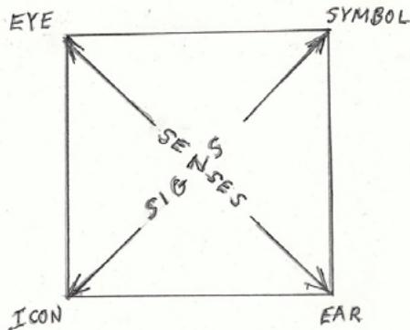
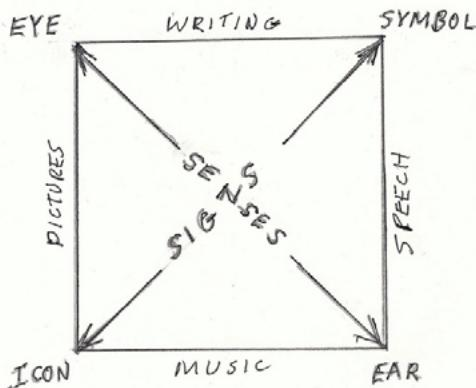
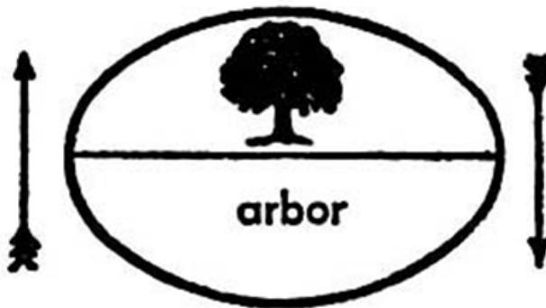
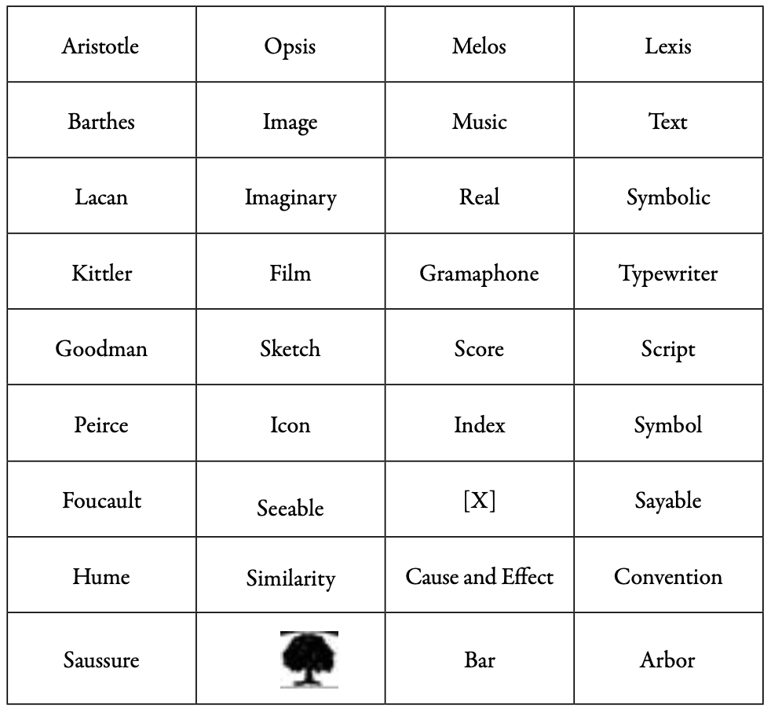

W. J. T. MITCHELL

University of Chicago

***

## Image x Text

What is the “imagetext”? We might begin not by asking, what it means, but how it can be written down. In a footnote to *Picture Theory* (1994) I took a stab at a notational answer:

> I will employ the typographic convention of the slash to designate the “image/text” as a problematic gap, cleavage, or rupture in representation. The term “imagetext” designates composite, synthetic works (or concepts) that combine image and text. “Image-text,” with a hyphen, designates *relations* of the visual and verbal.[^1]

Rupture, synthesis, relationship. The essays in the present volume range over all three of these possibilities. On the one hand, there are what we might call “literal” manifestations of the imagetext: graphic narratives and comics, photo texts, poetic experiments with voice and picture, collage composition, and typography itself. On the other hand, there are the figurative, displaced versions of the image-text: the formal divisions of narrative and description, the relations of vision and language in memory, the nesting of images (metaphors, symbols, concrete objects) inside discourse, and the obverse, the murmur of discourse and language in graphic and visual media. And then there is a third thing, the traumatic gap of the unrepresentable space between words and images, what I tried to designate with the “/” or slash.

It is that third thing that I would like to re-open in this essay. And I want to do it, again, “literally,” with an exploration of a typographic sign that might synthesize the three relationships of texts and images, and suggest further possibilities as well. My chosen sign is the “X,” and I wish to treat it as a Joycean verbo-voco-visual pun that condenses the following meanings and inscriptions: 1) X as the “unknown” or “variable” in algebra, or the “X factor” in vernacular usage; the signature of the illiterate; 2) X as the sign of multiplication, or (even more evocatively) as the “times” sign; also as a slightly tilted or torqued modification of the simplest operation in mathematics, the “plus” sign (+); 3) X as the sign of chiasmus in rhetoric, the trope of changing places and dialectical reversal, as in “the language of images” providing “images of language;” another way to see this is to grasp the ways in which image and text alternately evoke differentials and similarities, a paradox we could inscribe by fusing the relation of image *versus* text with image *as* text, a double cross that could be notated with an invented symbol, “VS” overlapped with “AS” to produce a double X in the intersection of A and V; 4) X as an image of crossing, intersection, and encounter, like the iconic sign at a railroad crossing; 5) X as a combination of the two kinds of slashes (/ and \), suggesting opposite directionalities in the portals to the unknown, different ways into the gap or rupture between signs and senses, indicating the difference between an approach to words and images from the side of the unspeakable or the unimaginable, the invisible or the inaudible; 6) X as the phoneme of eXcess, of the eXtra, the unpredictable surplus that will undoubtedly be generated by re-opening the variety of relationships subtended by this peculiar locution, the imagetext. This is the sign of everything that has been left out of my construal of the X.

Why is it possible, even necessary, to formulate such an abundance of meaning around a simple relation between two elementary, even primitive terms like “text” and “image”? One scarcely knows where to begin. A simple opening is provided by the innocent little phrase, “visual and verbal representation,” that is often uttered as a kind of alternative to “word and image” or “text and image.” But a moment’s thought reveals a strange discontinuity, a shift of levels of meaning. In order to make anything specific out of the visual-verbal, we must ask, “visual as distinct from what”? “Verbal as opposed to what?” And the obvious candidates are: images or pictures as opposed to verbal signs; visual sensations as opposed to auditory. The visual denotes a specific sensory channel, the verbal designates a specific semiotic register. The difference between the visual and the verbal is actually *two* differences, one grounded in the senses (seeing versus hearing), the other in the nature of signs and meaning (words as arbitrary, conventional *symbols*, as distinct from images as representations by virtue of likeness or similitude). The phrase “visual-verbal,” then, produces a productive confusion of signs and senses, ways of producing meaning and ways of inhabiting perceptual experience. The following diagram provides a picture of this confusion:

Figure 1: ImageText Square of Opposition

The “X” that links and differentiates images and texts is the intersection between signs and senses, semiotics and aesthetics. It becomes evident at a glance, then, that the apparently simple concept of the imagetext opens up a kind of fractal expansion of terms, as is captured in a more fully elaborated version of the diagram:

Figure 2: ImageText Square of Opposition Elaborated

As the sensory-semiotic dimensions of the word-image difference expand, they begin to demand some essential distinctions. When we talk about “words,” for instance, are we referring to speech or writing? (Let us leave out, for the moment, gesture, which Rousseau saw as the original form of verbal expression, and which is fully elaborated today in the languages of the Deaf.)[^2] Does the “image-text” concept automatically rule out orality? On the side of the image, are we talking about visual images—e.g., drawings, photographs, paintings, sculpture? Or are we talking about auditory images, as in poetry and music? And what happens when we include the notion of “verbal imagery” (metaphor, description, etc.), which has not yet found a place in my diagram? Is this the “X” factor as an excess that overflows the boundary of any conceivable graphic diagram?

Any systematic analysis of the relation of images and texts, then, leads inevitably into a wider field of reflection on aesthetics, semiotics, and the whole concept of representation itself as a heterogeneous fabric of sights and sounds, spectacle and speech, pictures and inscriptions.[^3] This is a multiply articulated fabric, in which the warp and woof are constantly shifting not only from sensory channels (the eye and the ear) to semiotic functions (iconic likenesses and arbitrary symbols), but also to modalities of cognition (space and time) to operational codes (the analog and the digital). The fractal picture of the imagetext has scarcely begun with the “visual-verbal.” And then have to add the “thirds” that inevitably spring up between our binary oppositions, sometimes as compromise formations (could the “ana-lytical” itself be a demand for fusion or interplay between analog and digital codes?) and sometimes as blank spaces in which something unpredictable and monstrous might emerge. The gap between the Lacanian registers of the Symbolic and Imaginary is the black hole of the Real, the site of trauma and the unrepresentable (but clearly *not* an unnameable place, since there it is, the name of “the Real”). Could it be the “beach” or margin between sea and land that Foucault names as the frontier between the words and images in Magritte’s *Ceci n’est pas une pipe*? Is it a contested zone in which, as Foucault puts it, “between the figure and the text a whole series of intersections—or rather attacks launched by one against the other.”[^4] Could we then see our “X” as crossed lances (/ \ ) or “arrows shot at the enemy target, enterprises of subversion and destruction, lance blows and wounds, a battle.” (ibid) Leonardo da Vinci called the encounter of painting and poetry a *paragone* or contest, and Lessing described their relation as the frontier between two countries, normally friendly and peaceful, but sometimes launching invasions into their neighbors' territory.

There are, then, normal and normative relations between texts and images. One illustrates or explains or names or describes or ornaments the other. They complement and supplement one another, simultaneously completing and extending. That is why Foucault focuses on the “common frontier” between Magritte’s words and images, the “calm sand of the page,” on which “are established all the relations of designation, nomination, description, classification”—in short, the whole order of the “seeable and sayable,” the “visible and articulable,” that lays down the archaeological layers of knowledge itself.[^5] Word and image are woven together to create a reality. The tear in that fabric is the Real. Foucault makes the space between images and texts even more radical when he denies it the status of a space at all: ‘it is too much to claim that there is a blank or lacuna: instead, it is an absence of space, an effacement of the “common place” between the signs of writing and the lines of the image.’ X becomes, in this sense, the erasure or “effacement,” not just of something inscribed, but of the very space in which the inscription might appear, as if the X signified a pair of *slashes*, like the tearing of a page, or cuts in a canvas left by a militant iconoclast—or an artist like Lucio Fontana.

Let’s say, then, that the normal relation of text and image is complementary or supplementary, and that together they make up a third thing, or open a space where that third thing appears. If we take comics as our example, the third thing that appears is just the composite art form known as comics, combining text and image in a highly specific medium. But there is also a third thing in the medium of graphic narration that is neither text nor image, but which simultaneously links and separates them, namely, the *gutter*. These unobtrusive framing lines, as is well known, are neither words nor images, but indicators of relationships, of temporal sequence or simultaneity, or of notional camera movements in space from panorama to close-up. Avant-garde comics, from Smokey Stover to Art Spiegelman to Chris Ware, have often played with the gutter, cutting across it, treating it as a window that can be opened to hang out the laundry.

So the third thing, the X between text and image certainly does not have to be an absence. In fact, we might argue that there is always something positive, even in the blank space of the Real, the slash of the canvas, or the non-space beyond blankness. Something rushes in to fill the emptiness, some “X” to suggest the presence of an absence, the appearance of something neither text nor image. In *Iconology: Image, Text, Ideology*, I identified this third thing as my subtitle indicated, in the ideological framework that invariably suffuses the field of image-text relationships: the difference between the “natural” and “conventional” sign; the distinction between an illiterate viewer who can see what images represent, and a literate reader who can see through the image to something else (typically, a text). In the polemic of Lessing’s *Laocoon*, the difference between image and text is not only figured in the relation of different nations, but rendered literal in his characterization of French culture as obsessed with effeminate “bright eyes” and spectacle, while German (and English) culture are described as manly cultures of the word.

And if we survey the history of semiotics and aesthetics, we find the positive presence of the third element everywhere. The *locus classicus* is, of course, Aristotle’s *Poetics*, which divides the “means” or “medium” of tragedy into three parts: opsis, melos, lexis (spectacle, music, words). Or, as Roland Barthes would have it, *Image/Music/Text*. The X-factor in the imagetext problematic is music, or more generally, sound, which may be why “imagetext” has always struck me as slightly impoverished in that it confines *words* to the realm of writing and printing, and neglects the sphere of orality and speech, not to mention gesture.[^6] Sometimes this silencing of the third dimension becomes explicit, most famously in Keats’s “Ode on a Grecian Urn,” where the text not only conjures up the *sight* and image of its titular subject, but further attributes to it a silent music and speech—“a leafy tale” told “more sweetly than our rhyme,” accompanied by an “unheard” music. The radio comedians Bob and Ray used to pose the riddle, why is radio superior to television? The answer: because the images we see while listening to the radio are better, more vivid, dynamic, and vital.

The triad of image/music/text must be the most durable and deeply grounded taxonomy of the arts and media that we possess, because it recurs constantly in the most disparate contexts, defining the elements of the Wagnerian *Gesamstkunstwerk*, the components of cinema, radio, and television, and even the order of technical media that constitute modernity. I am thinking here of Friedrich Kittler’s masterpiece, *Gramaphone/Film/Typewriter*, which is, on the one hand, an updating of the old Aristotelian categories, and, on the other, a trio of inventions subject to a new technical synthesis in the master platform of the computer. (Kittler 1999)

Finally, we must turn to the role of the imagetext in the constitutive elements of semiotics, the fundamental theory of signs and meaning. There we encounter Saussure’s famous diagram of the linguistic sign as a bifurcated oval with an image of a tree in the upper compartment and the word “arbor” in the lower.

Figure 3: from Ferdinand de Saussure, *Course in General Linguistics* (1915)

It is as if Saussure were forced to admit that even words, speech, and language itself cannot be adequately represented by a purely linguistic notation.[^7] The image, which stands here not just for a tree but for the *signified* or mental image conjured by the verbal signifier, actually stands *above* and prior to the word in the model of language itself. Saussure is building upon a picture of language that could be traced back into the psychology of empiricism in which mental images are the content named by words, or all the way to Plato’s discussion of natural and conventional signs in the *Cratylus*. But we also have to notice that the imagetext is not all there is to the sign, and there is a surplus of “third elements”: the oval which is presumably a graphic rendering of the wholeness of the sign, despite its binary structure; the arrows which stand for the bi-directionality of meaning, a kind of circuit of alternating current between spoken words and ideas in the mind; and (most important) the *bar* between signifier and signified, the index of the fundamental duality of language and thought.

But this mention of the index must bring to mind immediately the most comprehensive analysis of the sign to date, the semiotics of Charles Sanders Peirce who identified three elements or sign-functions that make meaning possible. These are the elements he calls “icon/index/symbol,” a triad that describes (very roughly) the distinctions between images (pictures, but also any sign by resemblance, including metaphors), indexical signs (arrows and bars, for instance, but also pronouns and other deictic words that depend upon context), and symbols (signs by “law” or convention). The relation of image and symbol, we must note, is merely analogous to and at a quite different level from the image-text relation. The reason is Peirce is not interested in classifying signs by their singular manifestations such as “words and images,” but by their *sign function*, which depends upon the way in which they make meaning. The category of the icon includes pictures and other visual, graphic images, but it is not exhausted by those things. Icons can appear in language as metaphor and in logic in the form of analogy: *a* is to *b* as *c* is to *d*. They are signs by resemblance or likeness. Similarly, indices may be exemplified by arrows and bars, but they also include elements of language such as deictic terms (this, that, there, then) and pronouns such as I, we, and you. Indices are “shifters” or existential signs that take their meaning from context. They are also signs by cause and effect (tracks in the snow indicating where someone has walked; smoke as an indicator of fire). And finally, symbols are signs that take their meaning from arbitrary conventions (we will let the word “arbor” stand for this vertical object sprouting with leaves).

From Peirce’s standpoint, then, the image/text is simply a figure for two-thirds of the semiotic field, awaiting only the recognition of its third element, the “/” as the index of a slash or relational sign in the concrete thing (a text, a work of art) that is being decoded. All these triads of aesthetics and semiotics can be seen at a glance in the following table, to which I want to add one final layer that will, as it were, bring us back to the surface of these reflections, and the original question of how to write these things down. I’m thinking here of Nelson Goodman’s theory of notation, which examines the way marks themselves

can produce meaning, and which relies heavily on categories such as “density” and “repleteness” (where every difference in a mark is potentially significant), and “differentiated” and “articulate” (where marks belong to a finite set of characters that have definite meaning, as in an alphabet, in which the letter “a” still means “a,” “regardless of whether it is written or typed or printed in Gothic or Times New Roman). (Goodman, 1976, 127–177) Goodman’s categories, in contrast to Peirce’s, take us back to the surface of inscription. His triad (sketch, score, and script) reinscribes the image/music/text triad, but this time at the level of notation.

I hope it is clear that this table does not postulate some kind of uniformity or even translatability down the columns. The rows are the strong elements, teasing out concepts of semiotics and aesthetics that happen to fall into these precise terms. The columns are merely iconic: they suggest a structural analogy between the ideas of radically different kinds of thinkers. Why, for instance, should we want to link music with the Lacanian Real? Kittler provides a technical answer based in recording apparatuses and the physical structure of the ear. (Kittler 1999, 74) Nevertheless, the whole point of this table is to produce a set of diagonal, X-shaped reflections that would slash across the rigid order of the columns: the arrows in Saussure's picture of the sign are indices, for sure. But are they not also icons in that they resemble arrows and symbols in that we have to know the convention of pointing? Point at an object to the average dog, and he will sniff your finger, not at the object.

We still have not addressed the most fundamental question, which is why the image/text rupture, the image-text relation, and the imagetext synthesis should be so fundamental to aesthetics and semiotics. Why do disciplines like art history and literary criticism find themselves inexorably converging around encounters of visual and verbal media? Why does the theory of representation itself seem to converge on this primitive binary opposition? My claim is that the imagetext is the convergence point of semiotics, the theory of signs, and aesthetics, the theory of the senses. It is the place where the eye and the ear encounter the logical, analogical, and cognitive relations that give rise to meaning in the first place. David Hume understood the laws of "association of ideas" as a triad very close to Peirce's analysis of the sign. Similarity, cause and effect, and convention are his three laws, corresponding quite precisely to Peirce's icon, index, and symbol. The imagetext, then, is a principle of thought, feeling, and meaning as fundamental to human beings as distinctions (and the accompanying indistinctions) of gender and sexuality. Blake glimpsed this when he asserted that the great Kantian modes of intuition, space and time are gendered as female and male respectively. And Lacan revised the Saussurean picture of the sign by portraying it as a pair of adjacent doors labeled "Men" and "Women," as if the gendered binary (and urinary segregation) was the foundation of semiosis itself. Of course, some will say that we have transcended all these binary oppositions in the digital age, when images have all been absorbed into the flow of information, and transgender persons are moving across sexual binaries. They forget that the dense, sensuous world of the analog does not disappear in the field of ones and zeros: it re-surfaces in the eye and ear ravished by new forms of music and spectacle, and in the hand itself, where "digits" (i.e., fingers) are literalized in the keyboard interface and game controller. Hardly surprising then, that the imagetext can play such a productive role in the range of essays included in this text, embracing poetry and photography, painting and typography, blogs and comics.

***

## References

Bauman, H. Dirksen, Jennifer L. Nelson, and Heidi M. Rose eds. 2006. *Signing the Body Poetic: Essays on American Sign Language Literature*. Berkeley: University of California Press. xv–xxiii.

Deleuze, Gilles. 1988. *Foucault*. Minneapolis: University of Minnesota Press.

Foucault, Michel. 1983. *This Is Not a Pipe*. Trans. James Harkness. Berkeley: University of California Press.

Goodman, Nelson. 1976. *The Languages of Art*. Indianapolis: Hackett.

Kittler, Friedrich A. 1999. *Gramophone, Film, Typewriter*. Trans. Geoffrey Winthrop-Young and Michael Wutz. Stanford: Stanford University Press.

Mitchell, W. J. T. 1986. *Iconology*. Chicago: University of Chicago Press. ----- 1994. *Picture Theory: Essays on Verbal and Visual Representation*. Chicago: University of Chicago Press.

Nelson, Robert, and Richard Schiff eds. 1996. *Critical Terms for Art History*. Chicago: University of Chicago Press.

***

## Footnotes

[^1]: Mitchell 1994, 89. See also chapter three, “Beyond Comparison: Picture, Text, and Method,” and the concluding chapter, “Some Pictures of Representation.” Other key writings on the concept of the imagetext include Mitchell 1986 and “Word and Image,” in Nelson and Schiff eds. 1996.

[^2]: See my “Utopian Gestures: The Poetics of Sign Language,” preface to H. Dirksen Bauman, Jennifer L. Nelson, and Heidi M. Rose eds. 2006, xv–xxiii.

[^3]: See “Some Pictures of Representation,” the conclusion to Mitchell 1994, 417–425.

[^4]: Foucault 1983, 26. Foucault also refers to the blank space between the pipe and its caption as a “crevasse—an uncertain foggy region” (ibid, 28).

[^5]: For an account of the way Foucault’s playful reflections on Magritte’s imagetext composition serve as a basis for his whole archaeological method, see Deleuze 1988, 80.

[^6]: A version of the Aristotelian and Barthesian triad was institutionalized some years ago in the University of Chicago’s common core as a year-long course sequence in “Media Aesthetics” entitled “Image/Sound/Text.”

[^7]: Since Saussure’s text was a compilation of lecture notes by himself and his students, it is not possible to be certain that this diagram was actually drawn by the great linguist. Nevertheless, it has become a canonical picture of his understanding of the linguistic sign.